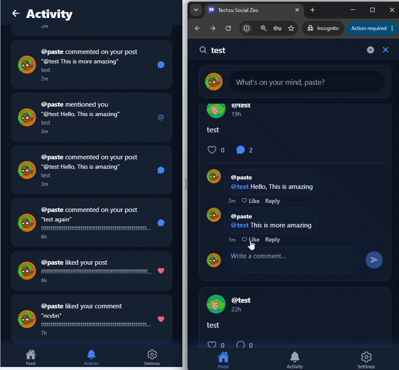
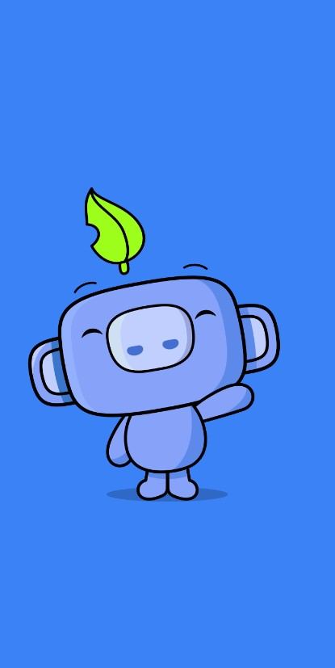
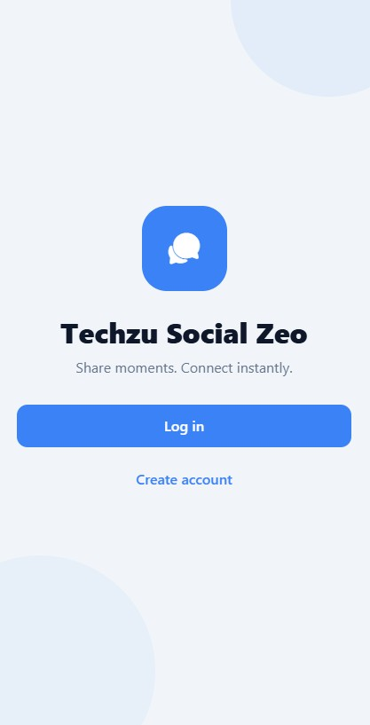
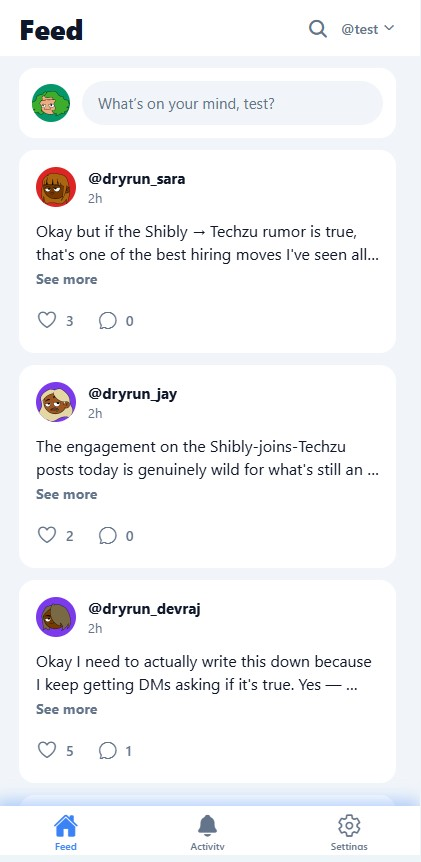
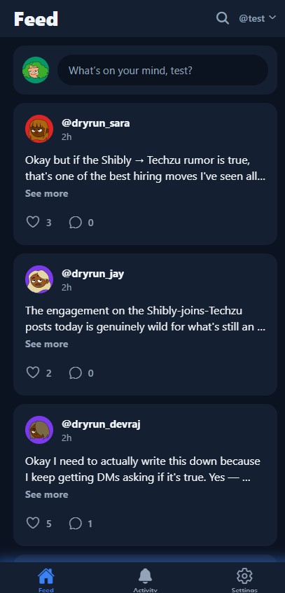
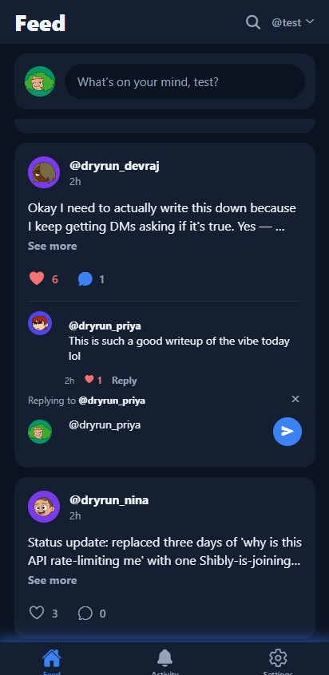
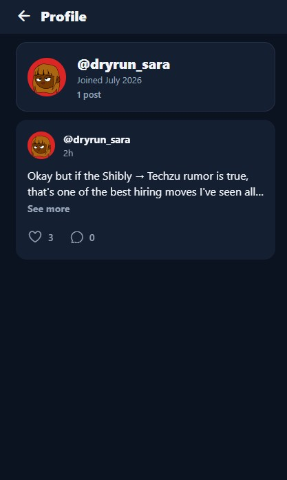

# Techzu Social Zeo

A lightweight social media application where users can post text updates, browse a shared feed, like and comment on posts, and receive real-time push notifications (Firebase Cloud Messaging) when their posts get interactions.

> **Deliverable links**
>
> - **APK download:** [Google Drive](https://drive.google.com/drive/folders/12-Qby60wn2TaNcsWxUL6DPGdneeTKGz1?usp=sharing)
> - **Live API:** [https://techzu-social-zeo.onrender.com](https://techzu-social-zeo.onrender.com)
> - **GitHub:** [Shibly-Noman/techzu-social-zeo](https://github.com/Shibly-Noman/techzu-social-zeo)

## Installation Documentation

### Option 1 — Install the APK (fastest, recommended)

No setup required: the APK is pre-configured to use the live backend.

1. On an Android phone or tablet, download the APK from the [Google Drive link](https://drive.google.com/drive/folders/12-Qby60wn2TaNcsWxUL6DPGdneeTKGz1?usp=sharing).
2. Open the downloaded file and install it — Android will ask to allow installs from this source (it's a direct APK, not from the Play Store). Confirm.
3. Open **Techzu Social Zeo**, create an account, and when prompted **allow notifications** — this is what enables the FCM push notifications.
4. The feed comes pre-seeded with demo users and content, so every feature (threads, mentions, comment likes, profiles) is visible immediately.

> ⏱️ **Note:** the API runs on Render's free tier, which sleeps after ~15 minutes of inactivity. The very first request (login/signup) after a quiet period can take up to a minute while the server wakes — subsequent requests are fast.

**Trying push notifications with one device:** sign up a second account in a browser at the API level, or simply install the APK on two devices / ask a colleague — when account B likes, comments, replies, or `@mentions` account A, account A's device receives a push even with the app closed. Tapping it deep-links to the post.

### Option 2 — Run everything locally

**Backend** (needs Docker, *or* Node ≥ 20 + a MongoDB):

```bash
git clone https://github.com/Shibly-Noman/techzu-social-zeo.git
cd techzu-social-zeo
docker compose up --build     # API on http://localhost:4000 with its own MongoDB
```

Without Docker: `cd backend && npm install && cp .env.example .env` (fill in `MONGODB_URI` + `JWT_SECRET`) `&& npm run dev`.

Verify the API end-to-end with the included 72-check test suite: `cd backend && npm run smoke`.

**Mobile** (needs Node ≥ 20):

```bash
cd mobile
npm install
npm start          # scan the QR with the Expo Go app, or press 'a' for Android emulator
```

In dev the app automatically targets port 4000 on the machine running Metro. Push notifications need a real build (they don't work inside Expo Go) — see [mobile/README.md](mobile/README.md) for the EAS build steps.

**Full details:** [Backend setup & API documentation](backend/README.md) · [Mobile setup & build instructions](mobile/README.md)

## Repository structure

| Folder | Description |
|---|---|
| [`backend/`](backend/) | Node.js + Express + TypeScript REST API (MongoDB Atlas, JWT auth, FCM) |
| [`mobile/`](mobile/) | React Native (Expo) + TypeScript mobile app |

## Tech stack

- **Backend:** Node.js, Express, TypeScript, MongoDB (Mongoose), JWT, Zod, firebase-admin (FCM HTTP v1)
- **Mobile:** React Native, Expo (expo-router), TanStack Query, Axios, expo-notifications, expo-secure-store
- **Infra:** MongoDB Atlas, Render (API hosting), EAS Build (APK), Firebase Cloud Messaging

## Features

- Signup / login with JWT authentication
- Create text-only posts
- Shared feed — paginated, newest first, infinite scroll, pull-to-refresh
- Filter feed by username (server-side search)
- Like / unlike posts (optimistic UI)
- Comment on posts, reply to comments (one level deep), like comments
- `@mention` a user in a comment with autocomplete
- User profiles (username, join date, post count) and username search
- Push notifications via FCM for likes, comments, replies, comment likes, and mentions
- In-app notifications screen with unread badge
- Light / dark / system theme
- Tablet-responsive layouts

## Architecture overview

```
┌─────────────┐        HTTPS/JSON         ┌──────────────┐
│  Expo App   │ ────────────────────────► │  Express API │
│ (React      │ ◄──────────────────────── │  (Render)    │
│  Native)    │                           └──────┬───────┘
└──────▲──────┘                                  │
       │                                 ┌───────▼───────┐
       │        FCM push                 │ MongoDB Atlas │
       └──────────────┐                  └───────────────┘
                ┌─────┴──────┐
                │  Firebase  │ ◄── firebase-admin (HTTP v1)
                │    FCM     │      sends on like/comment
                └────────────┘
```

## Screenshots

### Live push notification (FCM)

Account B likes a post → account A's device receives the push in real time:



### App screens

| Splash | Welcome | Feed (light) |
|:---:|:---:|:---:|
|  |  |  |

| Feed (dark) | Comment thread — replies & likes | Profile |
|:---:|:---:|:---:|
|  |  |  |
